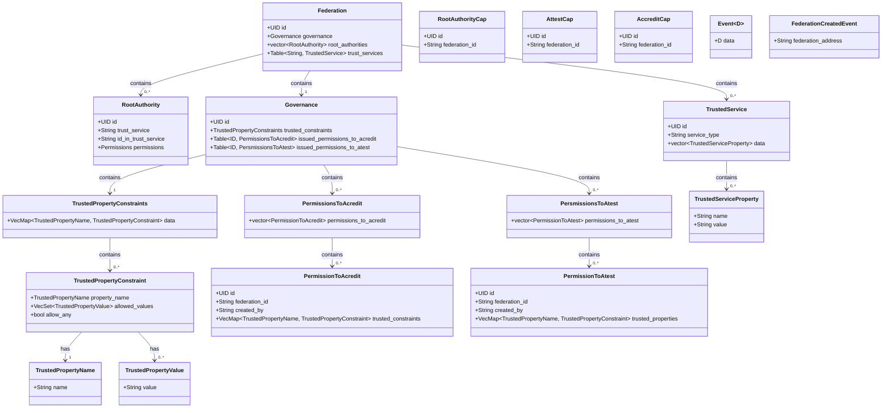

# The HTF notary

## The class diagram

```mermaid
classDiagram
    class Federation {
        +UID id
        +Governance governance
        +vector~RootAuthority~ root_authorities
        +Table~String, TrustedService~ trust_services
    }

    class RootAuthority {
        +UID id
        +String trust_service
        +String id_in_trust_service
        +Permissions permissions
    }

    class Governance {
        +UID id
        +TrustedPropertyConstraints trusted_constraints
        +Table~ID, PermissionsToAcredit~ issued_permissions_to_acredit
        +Table~ID, PersmissionsToAtest~ issued_permissions_to_atest
    }

    class RootAuthorityCap {
        +UID id
        +String federation_id
    }

    class AttestCap {
        +UID id
        +String federation_id
    }

    class AccreditCap {
        +UID id
        +String federation_id
    }

    class Event~D~ {
        +D data
    }

    class FederationCreatedEvent {
        +String federation_address
    }

    class TrustedPropertyConstraints {
        +VecMap~TrustedPropertyName, TrustedPropertyConstraint~ data
    }

    class TrustedPropertyConstraint {
        +TrustedPropertyName property_name
        +VecSet~TrustedPropertyValue~ allowed_values
        +bool allow_any
    }

    class PermissionsToAcredit {
        +vector~PermissionToAcredit~ permissions_to_acredit
    }

    class PermissionToAcredit {
        +UID id
        +String federation_id
        +String created_by
        +VecMap~TrustedPropertyName, TrustedPropertyConstraint~ trusted_constraints
    }

    class PersmissionsToAtest {
        +vector~PermissionToAtest~ permissions_to_atest
    }

    class PermissionToAtest {
        +UID id
        +String federation_id
        +String created_by
        +VecMap~TrustedPropertyName, TrustedPropertyConstraint~ trusted_properties
    }

    class TrustedPropertyName {
        +String name
    }

    class TrustedPropertyValue {
        +String value
    }

    class TrustedService {
        +UID id
        +String service_type
        +vector~TrustedServiceProperty~ data
    }

    class TrustedServiceProperty {
        +String name
        +String value
    }

    Federation --> "1" Governance : contains
    Federation --> "0..*" RootAuthority : contains
    Federation --> "0..*" TrustedService : contains
    Governance --> "1" TrustedPropertyConstraints : contains
    Governance --> "0..*" PermissionsToAcredit : contains
    Governance --> "0..*" PersmissionsToAtest : contains
    PermissionsToAcredit --> "0..*" PermissionToAcredit : contains
    PersmissionsToAtest --> "0..*" PermissionToAtest : contains
    TrustedPropertyConstraints --> "0..*" TrustedPropertyConstraint : contains
    TrustedPropertyConstraint --> "1" TrustedPropertyName : has
    TrustedPropertyConstraint --> "0..*" TrustedPropertyValue : has
    TrustedService --> "0..*" TrustedServiceProperty : contains

```
