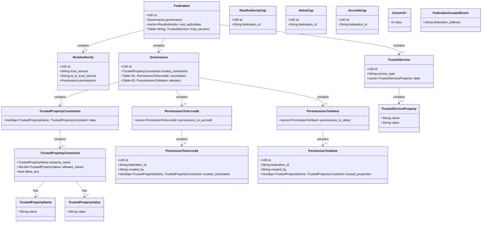

# HTF Notary Module

## Overview

The HTF Notary module is designed to create and manage a hierarchical trust system within a blockchain federation. This module facilitates the issuance and validation of credentials, accreditation, and attestation permissions, as well as governance over trusted properties and services.

## Key Concepts

### Federation

A `Federation` represents a collection of entities with a shared trust framework. It includes governance policies, root authorities, and trusted services. The federation ensures that only authorized entities can issue and validate credentials and permissions.

### Root Authority

`RootAuthority` is the highest level of trust within the federation. Root authorities have the capability to delegate trust to other entities and manage permissions for accreditation and attestation.

### Governance

The `Governance` component defines the policies and constraints of the federation. It maintains the trusted properties, issues permissions for accreditation and attestation, and ensures that all operations comply with the defined constraints.

### Permissions and Capabilities

- **RootAuthorityCap**: Grants the ability to manage root authorities within the federation.
- **AttestCap**: Allows the holder to issue attestations for trusted properties.
- **AccreditCap**: Allows the holder to issue accreditations for trusted properties.

### Trusted Properties and Constraints

Trusted properties are attributes that are recognized and verified within the federation. Constraints define the rules and acceptable values for these properties, ensuring that all credentials adhere to the federation's standards.

## Workflow

1. **Creating a Federation**:

   - A new federation is initialized with governance policies, root authorities, and trusted services.
   - An event is emitted to signal the creation of the federation.

2. **Adding Root Authorities**:

   - Root authorities are added to the federation, granting them the highest level of trust.
   - These authorities can delegate permissions and manage trusted properties.

3. **Issuing Permissions**:

   - Permissions for accreditation and attestation are issued to entities within the federation.
   - Entities with `AccreditCap` can grant accreditation permissions, while those with `AttestCap` can issue attestations.

4. **Adding Trusted Properties**:

   - Trusted properties and their constraints are defined within the federation.
   - Constraints ensure that only valid values are accepted for each property.

5. **Issuing and Validating Credentials**:

   - Credentials are issued based on trusted properties and their constraints.
   - Credentials are validated by checking against the federation's trusted constraints and the permissions of the issuing entity.

6. **Governance and Constraints**:
   - The governance component enforces policies and constraints, ensuring all operations adhere to the federation's standards.
   - Permissions and credentials are managed and validated according to these constraints.

## Use Cases

- **Decentralized Identity Management**: The module can be used to manage decentralized identities, ensuring that credentials are issued and validated according to a strict set of rules and constraints.
- **Supply Chain Verification**: Trusted properties can represent attributes of goods, and credentials can certify the authenticity and origin of these goods within a supply chain.
- **Access Control**: Permissions can be used to control access to resources, ensuring only accredited entities can access certain information or services.

## The class diagram

