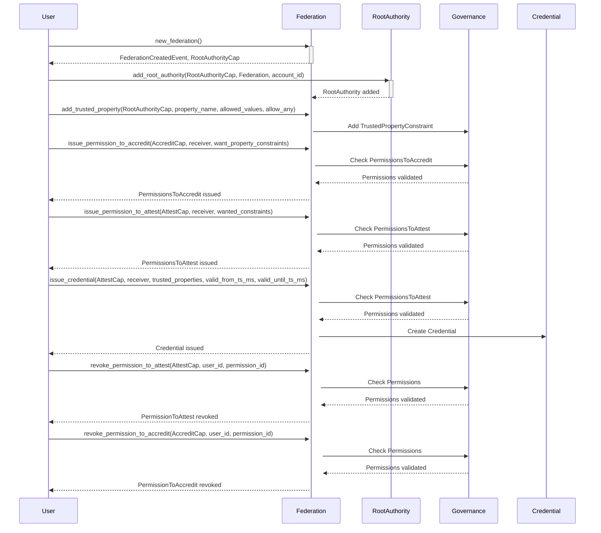
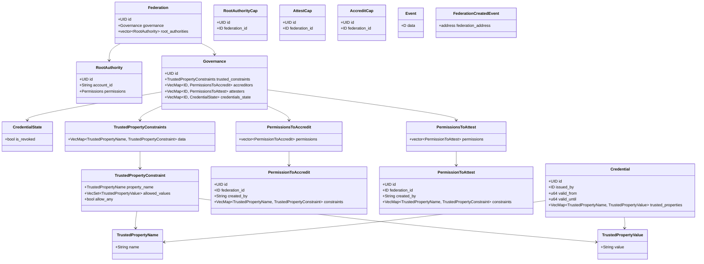

# HTF Notary Module

The HTF Notary module is designed to manage a hierarchical trust system within a federation. It includes structures and methods for creating federations, issuing credentials, and managing permissions to attest and accredit trusted properties. This module leverages the Move programming language and the Sui blockchain.

## Overview

The HTF Notary module provides a framework for establishing and managing trust within a federation of entities. It includes mechanisms for:

1. **Creating Federations**: A federation is the primary structure representing a group of entities with a shared trust framework.
2. **Issuing Credentials**: Credentials are issued to entities within the federation, attesting to certain trusted properties.
3. **Managing Permissions**: Permissions to attest and accredit are managed to control who can issue credentials and what properties they can attest to.
4. **Governance**: A governance structure manages the rules and constraints for trusted properties and credentials.

## Key Components

### Federation

A `Federation` represents the hierarchy of trust in the system. It is a shared object that includes a set of root authorities and a governance structure.

### Root Authority

Root authorities are entities with the highest level of trust within a federation. They can delegate trust to other entities and manage permissions.

### Governance

The governance structure within a federation manages the trusted property constraints, accreditors, attesters, and the state of issued credentials. It ensures that only authorized entities can issue and attest credentials.

### Credentials

Credentials are issued to entities within the federation, attesting to specific trusted properties. Each credential has a validity period and can be revoked if necessary.

### Permissions

Permissions control the ability to attest and accredit trusted properties. There are two main types of permissions:
- **Permissions to Accredit**: Allow entities to delegate the ability to attest to other entities.
- **Permissions to Attest**: Allow entities to attest to certain trusted properties.

### Trusted Property Constraints

Trusted property constraints define the rules and allowed values for properties that can be included in credentials. These constraints ensure that credentials issued within the federation adhere to the federation's governance rules.

## Workflow

1. **Create a Federation**:
   - Use the `new_federation` function to create a new federation.
   - The creator is granted the root authority capability.

2. **Add Root Authorities**:
   - Root authorities are added to the federation using the `add_root_authority` function.
   - Root authorities manage trust delegation within the federation.

3. **Define Trusted Properties**:
   - Define trusted properties and their constraints using the `add_trusted_property` function.
   - These properties are used in credentials issued within the federation.

4. **Issue Permissions**:
   - Issue permissions to entities within the federation to allow them to accredit and attest trusted properties.
   - Use the `issue_permission_to_accredit` and `issue_permission_to_attest` functions.

5. **Issue Credentials**:
   - Use the issued permissions to create credentials for entities.
   - Use the `issue_credential` function to issue credentials with specified trusted properties and validity periods.

6. **Manage Credentials**:
   - Revoke or update credentials as needed based on the federation's governance rules.
   - Use the `revoke_permission_to_attest` and `revoke_permission_to_accredit` functions to manage permissions.




### Class diagram


## Functions

### new_federation

```rust
public fun new_federation(ctx: &mut TxContext)
```

Creates a new federation with an initial root authority. Emits a `FederationCreatedEvent` and transfers the root authority capability to the sender.

### add_trusted_property

```rust
public fun add_trusted_property(
  cap: &RootAuthorityCap,
  federation: &mut Federation,
  property_name: TrustedPropertyName,
  allowed_values: VecSet<TrustedPropertyValue>,
  allow_any: bool,
  _ctx: &mut TxContext
)
```

Adds a trusted property to the federation with specified constraints. Only callable by a root authority.

### issue_permission_to_accredit

```rust
public fun issue_permission_to_accredit(
  cap: &AccreditCap,
  federation: &mut Federation,
  receiver: ID,
  want_property_constraints: vector<TrustedPropertyConstraint>,
  ctx: &mut TxContext
)
```

Issues a permission to accredit specified trusted properties. Ensures the issuer has the necessary permissions to accredit.

### issue_permission_to_attest

```rust
public fun issue_permission_to_attest(
  cap: &AttestCap,
  federation: &mut Federation,
  receiver: ID,
  wanted_constraints: vector<TrustedPropertyConstraint>,
  ctx: &mut TxContext
)
```

Issues a permission to attest specified trusted properties. Ensures the issuer has the necessary permissions to attest.

### revoke_permission_to_attest

```rust
public fun revoke_permission_to_attest(
  cap: &AttestCap,
  federation: &mut Federation,
  user_id: &ID,
  permission_id: &ID,
  ctx: &mut TxContext
)
```

Revokes a permission to attest from a specified user. Ensures the issuer has the necessary permissions to revoke.

### revoke_permission_to_accredit

```rust
public fun revoke_permission_to_accredit(
  cap: &AccreditCap,
  federation: &mut Federation,
  user_id: &ID,
  permission_id: &ID,
  ctx: &mut TxContext
)
```

Revokes a permission to accredit from a specified user. Ensures the issuer has the necessary permissions to revoke.

### issue_credential

```rust
public fun issue_credential(
  cap: &AttestCap,
  federation: &mut Federation,
  receiver: ID,
  trusted_properties: VecMap<TrustedPropertyName, TrustedPropertyValue>,
  valid_from_ts_ms: u64,
  valid_until_ts_ms: u64,
  ctx: &mut TxContext
)
```

Issues a credential to a specified user with defined trusted properties and validity period. Ensures the issuer has the necessary permissions to attest the properties.

### validate_credential

```rust
public fun validate_credential(
  self: &Federation,
  credential: &Credential,
  ctx: &mut TxContext
)
```

Validates a credential to ensure it adheres to the federation's trusted property constraints, has not been revoked, and is within its validity period.

## Usage

To use the HTF Notary module:

1. **Create a Federation**: Use the `new_federation` function to create a new federation.
2. **Add Root Authorities**: Add root authorities to the federation, which will manage the delegation of trust.
3. **Define Trusted Properties**: Define the trusted properties and constraints that will be used in credentials.
4. **Issue Permissions**: Issue permissions to entities within the federation to allow them to accredit and attest to trusted properties.
5. **Issue Credentials**: Use the issued permissions to create and validate credentials for entities within the federation.
6. **Manage Credentials**: Revoke or update credentials as needed based on the federation's governance rules.

The HTF Notary module provides a robust framework for managing hierarchical trust within a federation, ensuring that only authorized entities can issue and attest to trusted properties.
