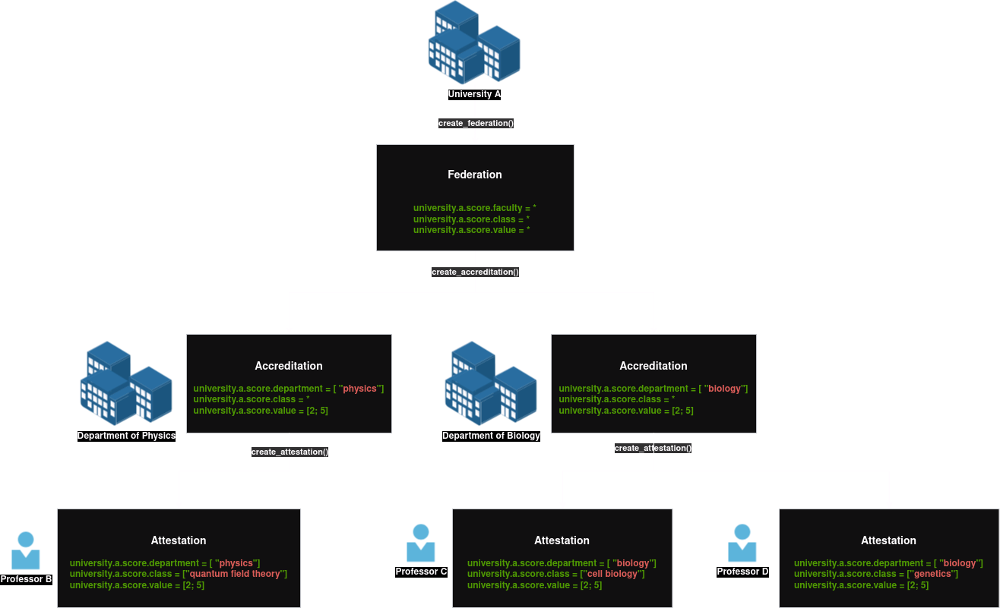
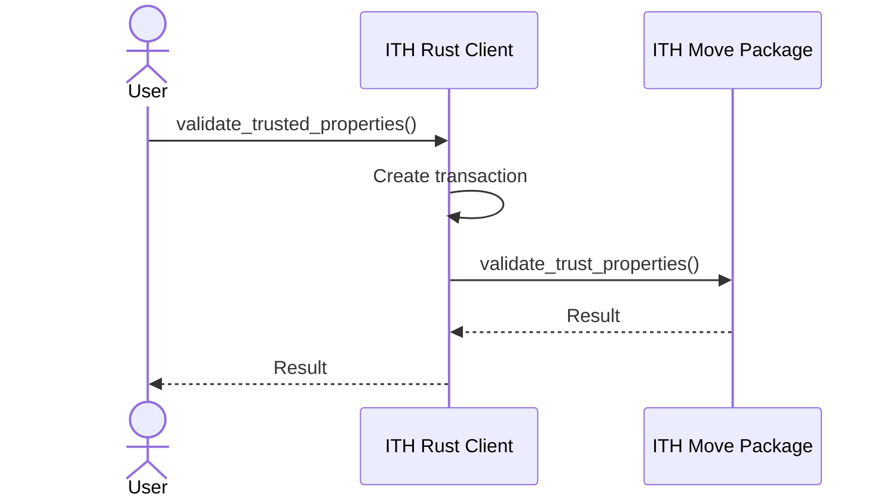
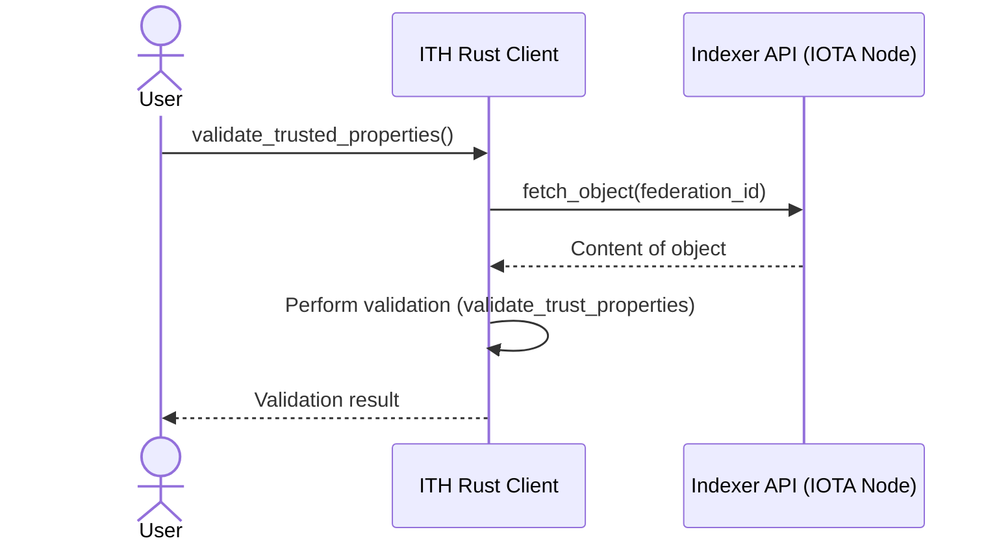
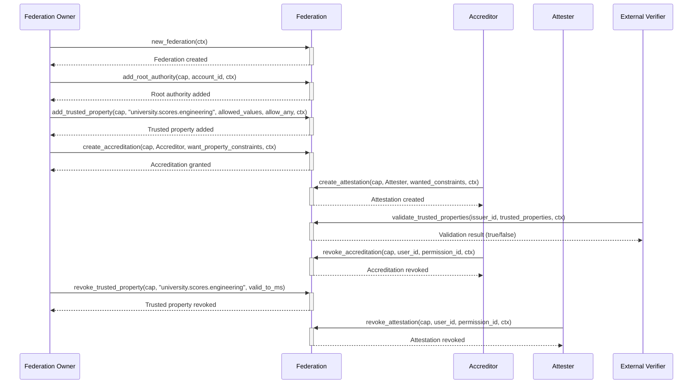

<div id="top"></div>

<br />
<div align="center">
    <a href="https://github.com/iotaledger/ith">
        
    </a>
    <div align="center">
      <h3>ITH</h3>
      <h4>IOTA Trust Hierarchies</h4>
    </div>
    
    <p align="center">
        <br />
        <br />
        <a href="https://github.com/iotaledger/ith/labels/bug">Report Bug</a>
        ·
        <a href="https://github.com/iotaledger/ith/labels/request">Request Feature</a>
    </p>
</div>
<details>
  <summary>Table of Contents</summary>
  <ol>
    <li>
      <a href="#introduction">Introduction</a>
    </li>
    <li>
      <a href="#example-scenario---university-grading-system">Overview</a>
      <ul>
        <li><a href="#problem-description">Description</a></li>
        <li><a href="#diagram">Diagram</a></li>
        <li><a href="#diagram-description">Diagram Description</a></li>
        <li><a href="#benefits-of-ith">Benefits</a></li>
      </ul>
    </li>
    <a href="#before-you-start">Before you start</a>
      <ul>
        <li><a href="#requirements">Requirements</a></li>
      </ul>
    </li>
    <a href="#getting-started">Getting Started</a>
      <ul>
        <li><a href="#installation-of-the-ith-smart-contract">Installation of the ITH package</a></li>
        <li><a href="#installation-of-ith-rust-library">Installation of the ITH Rust lib</a></li>
      </ul>
    </li>
    <a href="#usage">Usage</a>
      <ul>
        <li><a href="#getting-started-example">Getting Started Example</a></li>
        <li><a href="#examples">Examples</a></li>
      </ul>
    </li>
    <li>
     <a href="#achitecture-&-design">Architecture & Design</a>
     <ul>
      <li><a href="#domain-components">Domain components</a></li>
      <li><a href="#ith-components">ITH Components</a></li>
      <li><a href="#validation-process">Validation Process</a></li>
      </ul>
    </li>
    <li>
      <a href="#api">API</a>
      <ul>
        <li><a href="#specification">Specification</a></li>
        <li><a href="#api-usage-sequence-diagram">API Usage Sequence Diagram</a></li>
      </ul>
    </li>
    <li><a href="#contribute">Contribution</a></li>
    <li><a href="#license">License</a></li>
  </ol>
</details>

## Introduction

The **ITH (IOTA Trust Hierarchies)** is a non-opinionated solution designed to facilitate the hierarchical distribution of trust across entities in the IOTA network. It aims to simplify the process of building decentralized applications on the IOTA network by providing a way to establish an additional layer of trust and logic among entities.

In ITH, a **Federation** acts as the root authority for specific properties. The **Federation Owner** can delegate (accredit) trust to other entities, allowing them to attest to certain properties on behalf of the root authority. This creates a structured, decentralized system of trust.

### Example Scenario - University Grading System

#### Problem description

Let's imagine there is a University that has sub-units called departments. Each department has professors. When creating a credential, the University would like to delegate the authority for scoring to the departments, and the departments can further delegate this authority to the professors.

#### Diagram



#### Diagram Description

A **University** functions as the root authority within a federation, managing the accreditation of its departments:

- The **Department of Physics** is allowed (accredited) to delegate permission to assign scores within space `university.a.department` equals to `physics`
- The **Department of Biology** is allowed (accredited) to delegate permission to assign scores within space `university.a.department` equals to `biology`

Departments can further grant permissions to specific professors, enabling them to attest to grades for particular courses:

- **Professors A** can grade students in courses such as **Quantum Field Theory**
- **Professors B** is responsible for scoring students in courses **Cell Biology**

This setup allows the university to manage trust hierarchically, accrediting departments and professors to handle their respective responsibilities within their domains.

#### Benefits of ITH

- Modular: ITH supports flexible trust hierarchies that can be customized for different applications.
- Decentralized: Distributes authority across various trusted entities, aligning with the principles of decentralization.
- Scalable: Enables the creation of complex permission structures that can grow with your application’s needs.

## Before You Start

### Requirements

The ITH client library requires `Rust` and `Cargo`. You can find installation instructions in
the [Rust documentation](https://doc.rust-lang.org/cargo/getting-started/installation.html).

We recommend that you update the Rust compiler to the latest stable version first:

```shell
rustup update stable
```
<!-- TODO change to the published link -->
The ITH Smart Contract requires the IOTA network client binaries. You can find installation instruction in the [IOTA Documentation](https://github.com/iotaledger/iota/blob/develop/docs/content/developer/getting-started/connect.mdx)

## Getting Started

ITH comprises two main components:

- **IOTA Move Package**: A smart contract on the IOTA network responsible for creating and managing federations.
- **Rust Library**: A client library that interfaces with the IOTA Move package.

### Installation of the ITH smart contract

```shell
 cd iota.move
 iota client publish
```

### Installation of ITH rust library

To start using the ITH in your Rust project, you can include the following dependencies in your `Cargo.toml` file:

```toml
[dependencies]
iota-sdk = { git = "https://github.com/iotaledger/ith/ith.rs", branch = "dev" }
```

## Usage

### Getting Started Example

Please refer to the [`examples/getting_started/getting_started.rs`](/ith.rs/examples/getting_started/getting_started.rs) file for a quick walkthrough of the main operations in ITH.

### Examples

You can use the provided code [examples](ith.rs/examples) to get acquainted with the ITH. You can use the following command to run any example:

```bash
cargo run --release --example example_name
```

Where `example_name` is the name from the [Cargo.toml](sdk/Cargo.toml) name from the example folder. For example:

```bash
cargo run --release --all-features --example create_account
```

You can get a list of the available code examples with the following command:

```bash
cargo run --example
```

## Architecture & Design

### Domain Components

- **Federation**: A structured trust network within the ITH system representing a group of trusted entities. A federation defines the root authority and manages relationships among entities, trusted properties, and permissions. For example, a university could act as a federation, where departments and professors are accredited to manage and attest to specific properties like `university.scores.engineering`

- **Root Authority**: The highest authority within a federation, responsible for establishing and delegating trust. The root authority can accredit other entities to create attestations within the federation, extending the trust hierarchy.

- **Trusted Property**: An attribute or characteristic within the federation, such as `university.a.department`. Trusted properties are the elements within a federation that entities can attest to.

- **Attestation**: A statement or proof provided by an entity within the federation certifying the validity of a trusted property. For example, a professor’s attestation may confirm a student’s score in a particular course.

- **Accreditation**: A delegation mechanism where the root authority or accredited entity grants another entity the right to create attestations for a specific trusted property. This enables hierarchical trust distribution within the federation.

- **Trusted Property Value**: The assigned value for a trusted property (e.g., a score in a class), which can be a string or number and can be validated within the ITH structure.

- **Trusted Property Constraint**: Defines conditions or rules on trusted properties. It defines the possible values for Trusted Property's value. The Trusted Property Constraint support the basic expressions:

    | Expression   | Number | String | Example                          |
    |--------------|--------|--------|----------------------------------|
    | startsWith   | No     | Yes    | `startsWith("university.")`        |
    | endsWith     | No     | Yes    | `endsWith(".proposal")`            |
    | contains     | No     | Yes    | `contains("score")`                |
    | greaterThan  | Yes    | No     | `greaterThan(85)`                  |
    | lowerThan    | Yes    | No     | `lowerThan(50)`                    |
    | equals       | Yes    | Yes    | `university.scores`               |
    | setOf        | Yes    | Yes    | `["engineering", "philosophy"]`   |

### ITH Components

ITH comprises two main components, providing both on-chain and off-chain validation:

1. [**IOTA Move Package**](ith.move/): A smart contract on the IOTA network responsible for creating and managing federations. This package can operate independently and handles on-chain validations.

2. [**Rust Library**](ith.rs/): A client library that interfaces with the IOTA Move package. It enables off-chain validation of properties and federations by syncing with the on-chain data, offering a flexible approach to perform validations off-chain.

### Validation Process

Validation is the process that allows a consumer to verify if a given entity is authorized to attest to a specific property. To handle heavy loads efficiently, ITH introduces an optimization that enables fee-less "off-chain" validation.

ITH supports both on-chain and off-chain validation, allowing applications to choose the most suitable method for verifying attestations.

- **On-Chain Validation**: Users directly call a smart contract on the IOTA network, and validation logic is fully executed on-chain for a secure, decentralized approach.



- **Off-Chain Validation**: The Rust library synchronizes with the federation’s on-chain data but handles the validation logic off-chain. This approach provides faster validation without full reliance on the blockchain.



<!-- here the diagram -->

## API

### Specification

API specification can be found in the official rust documentation [link](https://docs.rs/ith/latest/ith/)

### API Usage Sequence Diagram

The following sequence diagram illustrates the interactions between various entities using the provided API methods, demonstrating how trust is managed within the federation:



#### Explanation of Diagram Steps

1. **Federation Creation**: The Federation Owner creates a federation with the `new_federation` method.
2. **Assign Root Authority**: The root authority is assigned to manage the federation using `add_root_authority`.
3. **Add Trusted Property**: The root authority defines a trusted property with `add_trusted_property`.
4. **Create Accreditation**: The root authority creates an accreditation for an accreditor to attest to specific properties.
5. **Create Attestation**: The accreditor creates an attestation for an attester to confirm scores.
6. **Validation by External Verifier**: An external verifier validates the attester’s authority via `validate_trusted_properties`.
7. **Revoke Accreditation**: The accreditor revokes an accreditation with `revoke_accreditation`.
8. **Revoke Trusted Property**: The root authority revokes a property with `revoke_trusted_property`.
9. **Revoke Attestation**: An attester revokes an attestation using `revoke_attestation`.

## Contribute

If you find any issues or have suggestions for improvements,
please [open an issue](https://github.com/iotaledger/ith/issues/new/choose) on the GitHub repository. You can also
submit [pull requests](https://github.com/iotaledger/ith/compare)
with [bug fixes](https://github.com/iotaledger/ith/issues/new?assignees=&labels=bug+report&projects=&template=bug_report.yml&title=%5BBug%5D%3A+),
[new features](https://github.com/iotaledger/ith/issues/new?assignees=&labels=&projects=&template=feature_request.md),
or documentation enhancements.

Before contributing, please read and adhere to the [code of conduct](/.github/CODE_OF_CONDUCT.md).

## License

The IOTA SDK is open-source software licensed under Apache License 2.0. For more information, please read
the [LICENSE](/LICENSE).
