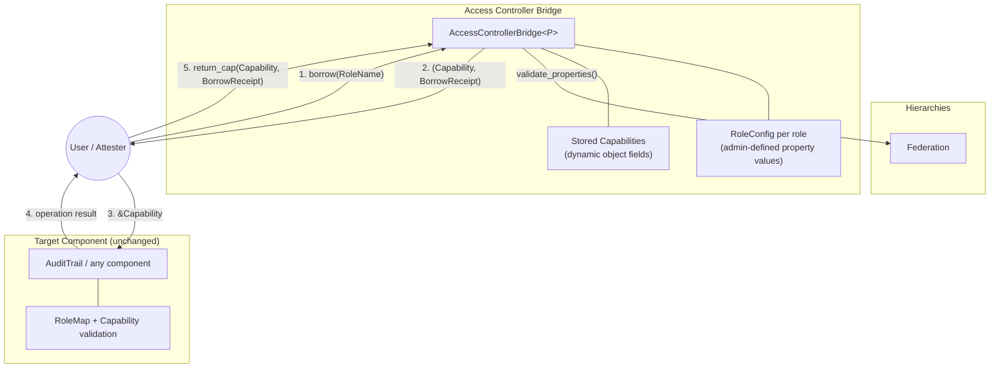
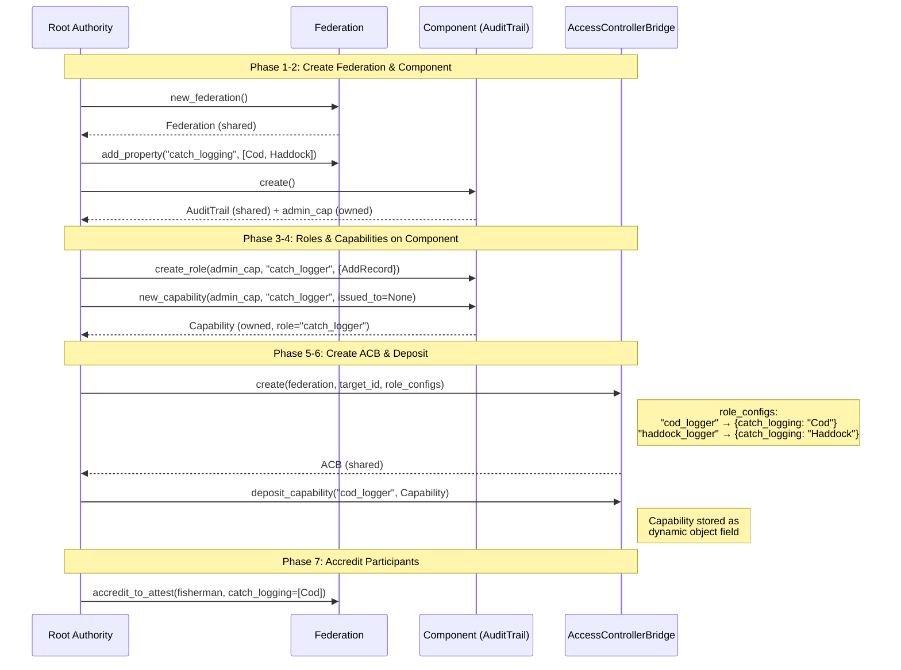
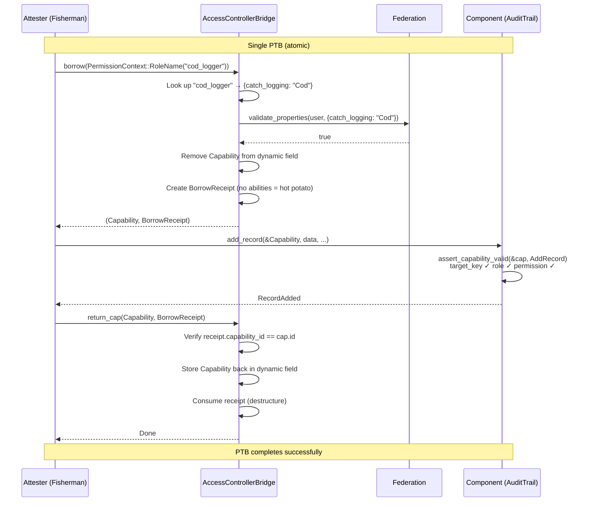
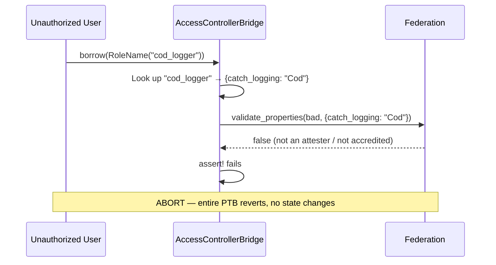
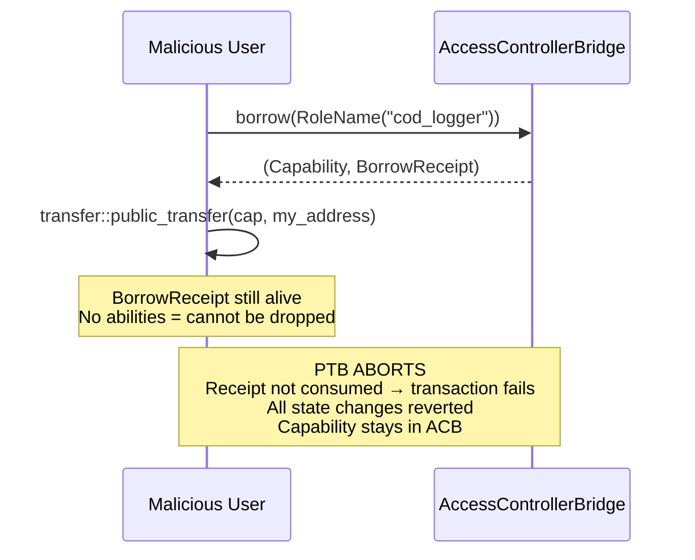
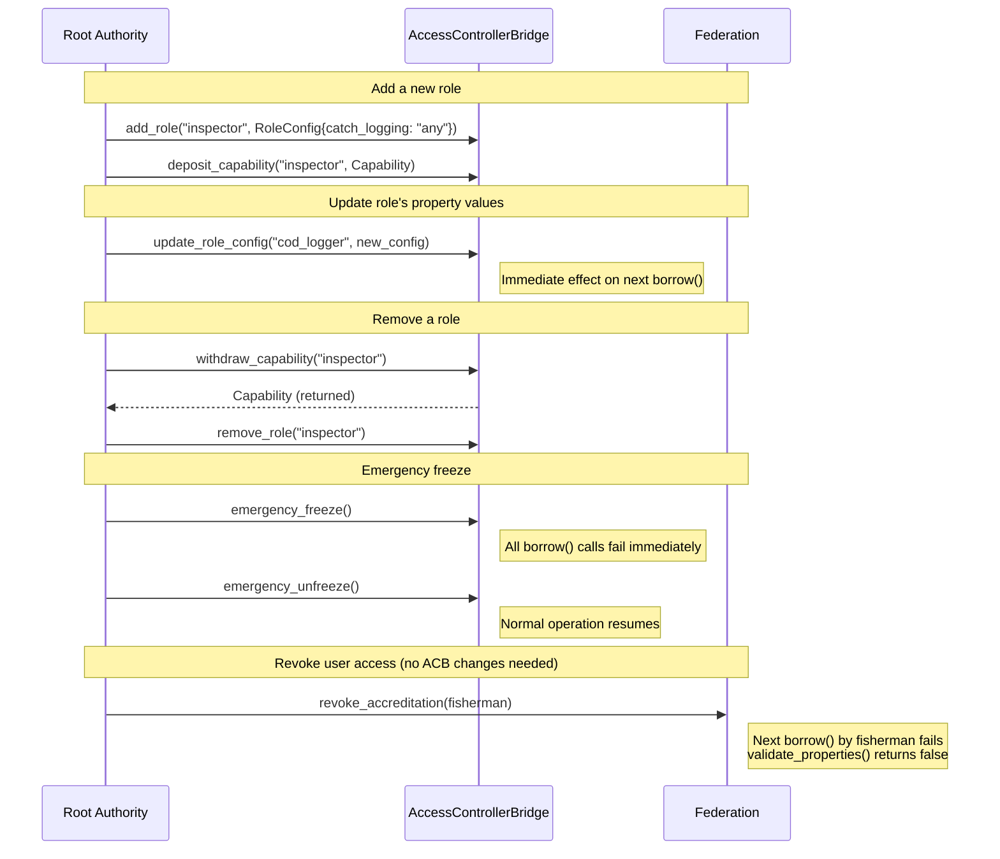

# Access Controller Bridge

Bridges hierarchies' federation trust model with component authorization using
the **Capability Custodian Pattern**.

The ACB stores `tf_components::Capability` objects and lends them to users who
pass federation validation, enforcing mandatory return via a hot-potato
`BorrowReceipt`. The target component (e.g. audit trail) is completely unaware
of the ACB — it sees a normal `&Capability` reference.

## Architecture



## Setup Flow



## Borrow-Use-Return Flow



## Authorization Rejected



## Why BorrowReceipt?

`Capability` has `key + store` abilities (required by existing tf_components — cannot be changed).
This means a user who receives a Capability *by value* can transfer it away and keep it permanently.

The `BorrowReceipt` has **no abilities** — it cannot be dropped, stored, copied, or transferred.
The only way to consume it is `return_cap()`, which requires giving back the matching Capability.
If the user tries to keep the Capability, the unconsumed receipt aborts the PTB.



## Lifecycle Management



## Usage

```move
// Borrow — just name the role, property values are admin-defined
let (cap, receipt) = bridge::borrow(
    &mut acb, &fed,
    bridge::role_name(utf8(b"cod_logger")),
    &clock, ctx,
);

// Use with any component that accepts &Capability
audit_trail::add_record(&mut trail, &cap, data, metadata, tag, &clock, ctx);

// Return (mandatory — receipt is a hot potato)
bridge::return_cap(&mut acb, cap, receipt, &clock);
```

## Security Considerations

- **Operational roles must NOT include governance permissions** (AddCapabilities,
  RevokeCapabilities, AddRoles, etc.). A user could otherwise mint themselves a
  persistent Capability during the borrow window.
- Governance operations should use the **direct path** — root authorities hold
  their own admin Capability and call the component directly.
- Admin defines exact property name+value pairs per role. The borrower cannot
  influence what values are validated — eliminating caller-chosen scope as an
  attack surface.

## Building

```bash
iota move build
```

## Testing

```bash
iota move test
```

## Dependencies

- `Hierarchies` — federation validation (`validate_properties`, `is_root_authority`)
- `TfComponents` — `Capability` struct and accessors
