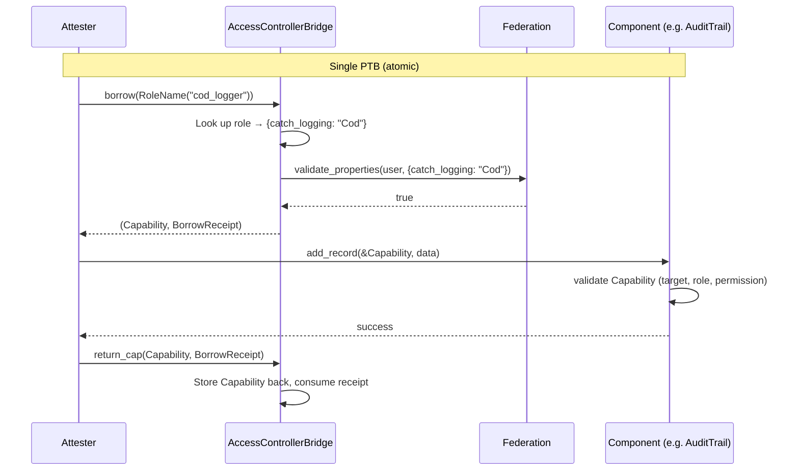

# Access Controller Bridge

The Access Controller Bridge (ACB) connects the **Hierarchies federation trust model** with **component-level authorization** using the Capability Custodian Pattern.

It stores `tf_components::Capability` objects and lends them to users who pass federation validation, enforcing mandatory return via a hot-potato `BorrowReceipt`. The target component (e.g. audit trail) is completely unaware of the ACB — it sees a normal `&Capability` reference.

## How It Works

The ACB acts as a **capability custodian**: it holds pre-provisioned Capabilities and lends them to users whose federation accreditation matches the role they request.

An admin defines **roles** on the ACB, each with exact property name+value pairs. When a user wants to perform an operation on a governed component, they request a role by name. The ACB validates their federation standing against the role's stored property values, lends the Capability, and requires its return — all within a single atomic transaction.

If the user does not return the Capability, the `BorrowReceipt` (which has no abilities — it cannot be dropped, stored, or transferred) remains unconsumed and the entire transaction aborts. This is what makes the authorization ephemeral.

## Key Concepts

**Roles** — Named configurations on the ACB. Each role defines the exact federation property values that must be validated, and holds one deposited Capability. Example: role `"cod_logger"` requires `{catch_logging: "Cod"}` and holds a Capability with audit trail role `"catch_logger"`.

**PermissionContext** — An enum passed to `borrow()`. Currently has one variant: `RoleName(String)`. The borrower names the role — they cannot influence what property values are validated.

**BorrowReceipt** — A hot-potato struct with no abilities. Created by `borrow()`, consumed by `return_cap()`. Forces the Capability to be returned within the same transaction.

**Phantom type P** — Provides organizational type safety. An `AccessControllerBridge<AuditTrailMarker>` is distinct from `AccessControllerBridge<IdentityMarker>` at the type level.

## Setup Flow

1. Create a **Federation** and add properties (standard hierarchies)
2. Create the **target component** (e.g. audit trail) with roles and permissions
3. Mint bearer **Capabilities** for operational roles (`issued_to: None`)
4. Create the **ACB** with role configs (role name → property name+value pairs)
5. **Deposit** Capabilities into the ACB (one per role)
6. **Accredit** participants in the federation

After setup, accredited attesters can borrow capabilities and operate on the target component.

## Lifecycle Management

| Operation | Function | Description |
|---|---|---|
| Add role | `add_role` / `add_role_with_capability` | Add a new role (optionally with Capability in one call) |
| Remove role | `remove_role` / `remove_role_and_withdraw` | Remove role (optionally withdrawing Capability in one call) |
| Update role | `update_role_config` | Change property values for an existing role |
| Freeze | `emergency_freeze` | Halt all borrows immediately |
| Unfreeze | `emergency_unfreeze` | Restore normal operation |
| Revoke access | Revoke accreditation in federation | Next borrow fails — no ACB changes needed |

## Security Properties

| Property | Enforcement |
|---|---|
| Authorization is ephemeral | BorrowReceipt (no abilities) forces return within PTB |
| Caller cannot choose scope | Property values are admin-defined per role |
| Revocation is immediate | Federation state checked at every borrow |
| Component is unaware of ACB | Sees standard `&Capability` — no modifications needed |
| Cannot forge Capabilities | `new_capability()` is `public(package)` in tf_components |
| Cannot forge receipts | `BorrowReceipt` can only be created by `borrow()` |

## Examples

Working examples are provided in both Rust and TypeScript. Each example is self-contained — it creates all required objects (federation, audit trail, ACB) and demonstrates the full flow against a live IOTA network.

- **[Rust examples](rs/examples/README.md)** — uses `iota-sdk` with `ProgrammableTransactionBuilder`
- **[TypeScript examples](ts/examples/README.md)** — uses `@iota/iota-sdk` with the `Transaction` API

## Design Document

The full design rationale, STRIDE security analysis, compliance analysis, and implementation plan are in [access-controller-bridge-v4.md](../../access-controller-bridge-v4.md).
