# IOTA Hierarchies: A Guide to Trust Distribution in the Information Age

## Introduction

In the age of information, where data is generated at an unprecedented scale, our primary challenge isn't accessing information but verifying its credibility and trustworthiness. With the rise of artificial intelligence, vast amounts of content can be created instantly, flooding our digital landscapes with facts, opinions, and fabrications. This abundance erodes traditional methods of judgment, where "more information" once equated to "more likely correct." Instead, we face a crisis of trust: how do we distinguish reliable knowledge from noise?

Consider the overwhelming volume of data we encounter daily—social media posts, news articles, scientific claims, and AI-generated content. Without mechanisms to assess credibility, misinformation spreads rapidly, leading to real-world consequences like eroded public trust in institutions, flawed decision-making, and societal divisions. The core issue is not just the information itself but how trust is established and distributed. Who gets to decide what's true, and how can we ensure that decision is reliable? This is where concepts like IOTA Hierarchies come into play, providing a structured way to delegate and verify trust in a decentralized manner.

IOTA Hierarchies builds on the principles of decentralized systems, allowing entities to form federations where trust is distributed hierarchically. It addresses the limitations of simple observations or majority votes by enabling "experts" to make verifiable statements with high confidence. By doing so, it creates a framework for credible attributions in large, complex systems—much like how societies organize through delegations of authority.

## The Problem of Trust and Its Distribution

Let's illustrate the challenge with a simple scenario: Imagine an animal in the wild, observed by two people. One observer says, "This animal is a dog," while the other insists, "This animal is a wolf." From an epistemological standpoint (the study of knowledge), both are making judgments about the subject—the animal—but neither provides certainty. These are mere predicates without backing evidence or authority.

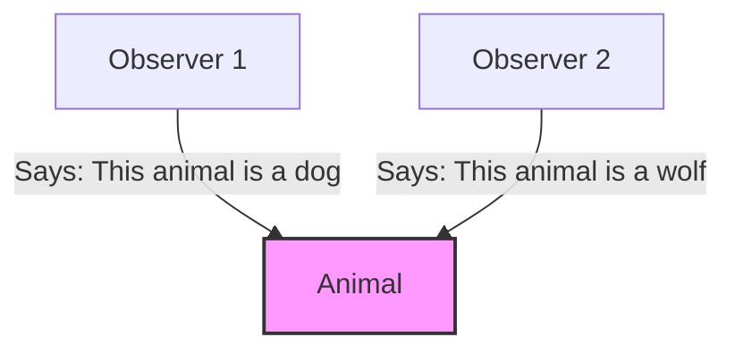

The issue here is certainty. We don't know whose judgment is accurate, and both carry a low level of belief. They guarantee nothing beyond personal opinion. To resolve this, we could:

- **Gather more observers and choose the most popular judgment**: This seems democratic but doesn't ensure accuracy. A majority might still be wrong if specialized knowledge is required (e.g., distinguishing subtle species differences).
- **Find a specialist to make an authoritative statement**: A qualified expert, like a biologist, can assert with high confidence, "This animal is a wolf," turning a mere predicate into a trusted statement equipped with evidence and authority.

The second approach is more reliable because it relies on expertise. However, it raises a new question: How do we identify and trust these specialists? Who verifies their competence? This is the essence of trust distribution—ensuring that only qualified entities can make credible claims. IOTA Hierarchies addresses this by creating federations of experts where abilities to attest (make statements) or accredit (delegate abilities) are distributed in a verifiable, hierarchical way.

Ultimately, IOTA Hierarchies isn't just about assigning attributes (like labeling an animal as a "wolf"); it's about managing the distribution of these attributes in systems with complex dependencies and delegations. This is crucial in large-scale environments where traceability of authority is essential, preventing unauthorized claims and ensuring accountability.

Now, extend this to a real-world example: a Federation of Biologists. This group unites experts in biology but recognizes that not all are qualified for every task—some specialize in mammals, others in birds. Through IOTA Hierarchies, the federation can distribute trust based on expertise areas.

**Federation of Biologists**: This top-level entity recognizes animals of various species. It divides into sub-units (accreditors) specialized in different animal types. These sub-units can accredit leaf-level entities (e.g., individual scientists) to attest about specific animals. For instance, a mammal specialist can only attest to mammal-related statements.

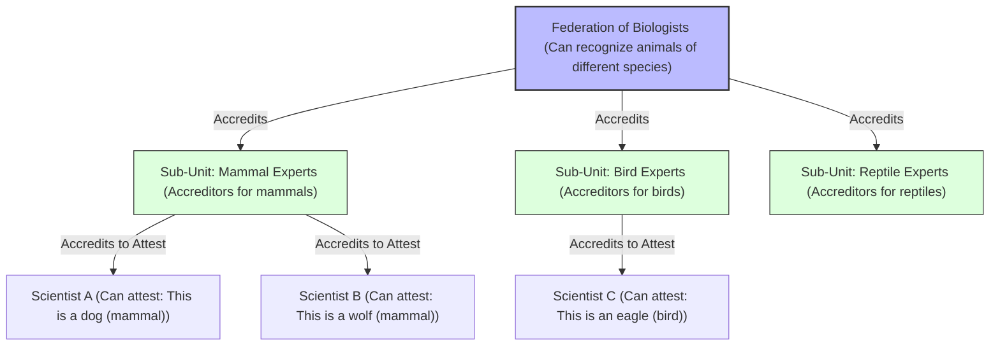

This hierarchical structure ensures trust flows logically: The federation delegates to specialists, who further delegate to attuned experts, creating a "hierarchy of rights" that's transparent and revocable.

### Trust Distribution in Everyday Life

Trust distribution isn't abstract—it's woven into human civilization. We rely on delegations of duties to build complex systems that small groups couldn't achieve alone. Hierarchies and organizations are hallmarks of human society, enabling evolution and innovation. Let's explore this narratively through examples:

- **Companies**: In a corporation, a CEO delegates financial decisions to a CFO, who accredits department heads to approve budgets. This hierarchy ensures accountability—much like IOTA Hierarchies, where revoking accreditation prevents misuse.

- **Universities**: A university president (root authority) accredits deans to manage faculties, who then accredit professors to grade students. Statements like "Student X earned an A in Biology" carry weight because of this delegated trust.

- **Government Institutions**: Laws are enacted by parliaments, delegated to agencies for enforcement, and further to local officers. Hierarchies ensure checks and balances, with revocation mechanisms for abuse.

- **Supply Chains**: A manufacturer accredits suppliers to certify product quality. If a supplier fails, accreditation is revoked, maintaining chain integrity.

- **Military**: Commanders delegate orders down the ranks, with strict hierarchies ensuring disciplined execution.

- **Medicine**: Hospitals accredit doctors to perform procedures, based on credentials from medical boards.

- **Households and Home Automation**: Even in smart homes, an AI assistant might be accredited by the homeowner to control devices, delegating tasks like adjusting lights based on occupancy—foreshadowing a future where AI takes over responsibilities with verifiable trust.

In all these cases, IOTA Hierarchies provides a digital analog: a decentralized, tamper-proof way to manage delegations, ensuring trust scales without central points of failure.

## Main Concepts of IOTA Hierarchies

IOTA Hierarchies derives its name from the hierarchical distribution of rights (accreditations) to attest or accredit. Everything begins with a **Federation**, created by an entity—any distinguishable object in the IOTA network, identified by a unique ID. Entities can be IOTA Identities, packages, organizations, people, or devices.

In a Federation, members can delegate the ability to make statements (attest) or further delegate (accredit) others. This naturally forms hierarchies, evolving as trust is distributed.

Every Federation has a **Root Authority**, typically its creator. This acts as the ultimate administrator, capable of adding or revoking properties under the federation's jurisdiction. A Federation must have at least one Root Authority, which holds authority over all properties and values.

## What is IOTA Hierarchies?

### Ideological Perspective: A Framework for Organized Trust

From an ideological standpoint, IOTA Hierarchies represents a fundamental reimagining of how trust and authority should be structured in digital systems. It embodies the principle that **trust is not binary** - it shouldn't be either fully centralized (where one entity controls everything) or completely decentralized (where everyone has equal say regardless of expertise).

Instead, Hierarchies recognizes that **expertise and responsibility should be distributed according to competence and context**. In the real world, we naturally organize into hierarchies based on knowledge, experience, and specialization. A medical diagnosis carries more weight when made by a licensed physician than by a random individual, not because of arbitrary authority, but because of demonstrated competence and accountability.

IOTA Hierarchies digitalizes this natural human organizational pattern, creating a system where:

- **Trust flows through merit-based hierarchies** rather than arbitrary power structures
- **Expertise is recognized and leveraged** through domain-specific accreditations
- **Accountability is maintained** through transparent delegation chains and revocation mechanisms
- **Flexibility enables evolution** as organizations grow and adapt to new challenges

This approach bridges the gap between the efficiency of organized hierarchies and the transparency and resilience of decentralized systems, creating what we call "**local centralization within global decentralization**."

### Technological Perspective: A Multi-Layer Architecture

From a technological standpoint, IOTA Hierarchies is a sophisticated system built on multiple layers, each serving specific purposes in the trust distribution ecosystem:

**Core Layer - Move Smart Contracts**: The foundation is implemented in the **Move programming language**, a secure and expressive language originally developed by Meta for blockchain applications. Move's resource-oriented programming model provides inherent security guarantees, making it ideal for managing trust relationships and preventing common smart contract vulnerabilities.

**Blockchain Infrastructure - IOTA Network**: The system is deployed on the **IOTA network**, leveraging its scalable, feeless, and energy-efficient distributed ledger technology. This provides the immutable foundation needed for trust relationships while ensuring global accessibility and transparency.

**Integration Layer - Rust Library**: A comprehensive **Rust library** provides high-level abstractions and utilities for interacting with the Move smart contracts. This library handles the complexity of blockchain interactions, transaction construction, and data serialization, making it easy for developers to integrate Hierarchies into Rust applications.

**Cross-Platform Access - WASM Bindings**: **WebAssembly (WASM) bindings** compile the Rust library to run in browsers and JavaScript environments, enabling **TypeScript and JavaScript** developers to use Hierarchies in web applications, Node.js servers, and other JavaScript runtimes without sacrificing performance or security.

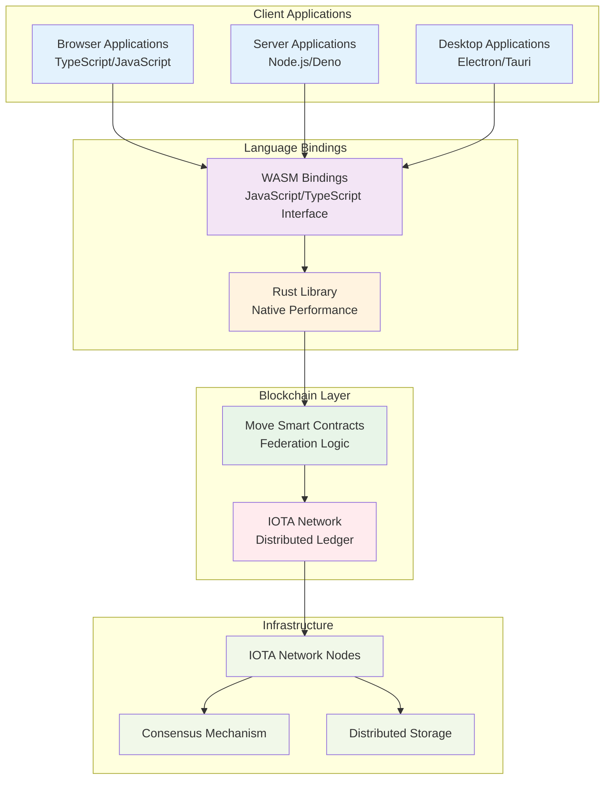

**Architecture Benefits**:

- **Security**: Move's resource-oriented design prevents common vulnerabilities like reentrancy attacks and ensures assets cannot be duplicated or lost
- **Performance**: Rust provides near-native performance while WASM enables efficient execution in browsers
- **Accessibility**: JavaScript/TypeScript bindings make the system accessible to the largest developer community
- **Scalability**: IOTA's feeless transactions enable micro-interactions and high-frequency operations
- **Interoperability**: The multi-layer approach allows integration with existing web technologies and blockchain ecosystems

This technological stack enables developers to build trust-based applications using familiar tools and languages while leveraging the security and transparency of blockchain technology. Whether building a simple web application or a complex enterprise system, developers can choose the appropriate layer of abstraction for their needs.

## The Federation: Foundation of Hierarchical Trust

The **Federation** serves as the core governance structure in IOTA Hierarchies, establishing and maintaining hierarchical trust relationships within a specific domain. A Federation functions as a trust distribution framework that enables entities to organize around shared objectives while maintaining defined authority structures.

### What is a Federation?

A Federation implements a trust distribution model that differs from both traditional centralized systems (where trust flows from a single point) and fully decentralized systems (where trust is distributed equally). Instead, Federations implement **local centralization**—structured hierarchies within the broader decentralized IOTA ecosystem.

This architecture addresses the requirements for organized decision-making processes while maintaining transparency, immutability, and resilience against single points of failure. Each Federation operates as an autonomous trust domain with its own governance rules, utilizing the security and transparency of the underlying blockchain infrastructure.

### What Does a Federation Do?

Federations provide the following governance functions:

- **Manage Trust Distribution**: Control which entities can make authoritative statements about specific topics, ensuring that only qualified entities can attest to claims within their designated domain.

- **Enforce Hierarchical Delegation**: Implement delegation patterns where root authorities can empower accreditors, who subsequently authorize attesters, establishing defined chains of responsibility.

- **Validate Credibility**: Provide mechanisms to verify whether a statement originates from an entity with legitimate authority to make such claims within the federation's scope.

- **Maintain Accountability**: Through transparent delegation chains and revocation mechanisms, enable the withdrawal of trust when entities do not meet their designated responsibilities.

### What Information Does a Federation Store?

Each Federation maintains several critical pieces of information that define its trust structure:

**Governance Structure**: The core organizational framework containing:

- **Trusted Statements**: A registry of all statement types that the Federation recognizes as valid within its domain
- **Accreditation Maps**: Detailed records of which entities have been granted rights to attest or accredit others, organized by entity identifier

**Authority Hierarchy**:

- **Root Authorities**: The foundational entities with ultimate administrative power over the Federation
- **Revoked Authorities**: A permanent record of authorities that have been stripped of their powers, ensuring transparency and preventing resurrection of revoked trust

**Permission Structures**:

- **Accreditations to Attest**: Rights granted to entities allowing them to make verifiable statements
- **Accreditations to Accredit**: Rights granted to entities allowing them to delegate authority to others

### How Does a Federation Store Information?

Federations utilize blockchain technology to ensure transparency, immutability, and accessibility:

**Shared Object Architecture**: The Federation is implemented as a shared object on the IOTA blockchain, providing accessibility to all network participants while maintaining data integrity through consensus mechanisms.

**Structured Data Storage**: Information is organized using the following data structures:

- Vector maps that link entity identifiers to their specific accreditations
- Vectors that maintain ordered lists of root authorities
- Structured objects that preserve complex relationships between statements, conditions, and permissions

**Event-Driven Transparency**: All significant Federation changes (adding authorities, granting accreditations, revoking permissions) emit events that create an auditable trail of governance decisions.

### The Root Authority: From Creator to Owner

Upon Federation creation, the creator automatically becomes the first **Root Authority**, establishing ownership of the trust domain. This transition from creator to authority establishes the initial governance structure and provides the foundation for all subsequent delegations.

Root Authorities possess ultimate administrative power within their Federation:

- Define statement types that are valid within the Federation's domain
- Add additional Root Authorities, distributing administrative power among trusted entities
- Grant accreditations directly without requiring permission from other entities
- Revoke authorities and accreditations as needed

This initial concentration of administrative power enables efficient decision-making and clear accountability during the Federation's establishment phase. As the Federation develops, Root Authorities can add additional authorities and distribute governance responsibilities, creating more resilient and distributed leadership structures.

### Local Centralization: Bridging Two Worlds

Perhaps the most fascinating aspect of Federations is how they implement **local centralization**—creating hierarchical authority structures within a fundamentally decentralized system. This hybrid approach captures the benefits of both organizational models:

**From Centralization**: Clear hierarchies enable efficient decision-making, specialized expertise, and accountable governance. A university Federation can have deans who specialize in different academic areas, each with authority over their domain but not others.

**From Decentralization**: Transparency ensures all delegation decisions are visible and auditable. Immutability prevents retroactive changes to trust relationships. Distribution means no single point of failure can compromise the entire system.

**The Synthesis**: Each Federation becomes a "centralized island" in the "decentralized ocean" of the blockchain. Multiple Federations can operate independently, each with their own governance structures, while still being part of the same secure, transparent network.

This design enables organizations to maintain their natural hierarchical structures while gaining the benefits of blockchain technology. A medical Federation might have a chief medical officer who accredits department heads, who then accredit individual doctors—mirroring real-world medical hierarchies while providing cryptographic proof of all delegation decisions.

Federations thus solve a fundamental challenge in trust distribution: how to scale expert judgment and institutional knowledge while maintaining transparency, accountability, and resistance to corruption. They provide the organizational framework that makes sophisticated trust relationships possible in digital systems.

### Federation Architecture

The following diagram illustrates the main components of a Federation and their relationships:

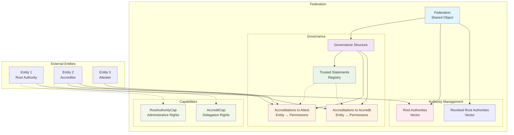

**Key Components:**

- **Federation**: The main shared object containing all governance structures
- **Governance**: Core management system containing trusted statements and accreditation mappings
- **Trusted Statements**: Registry of valid statement types within the federation's domain
- **Accreditations to Attest**: Mapping of entities to their attestation permissions
- **Accreditations to Accredit**: Mapping of entities to their delegation permissions
- **Root Authorities**: Vector of entities with ultimate administrative power
- **Capabilities**: Cryptographic tokens that enable specific operations (RootAuthorityCap for administration, AccreditCap for delegation)

**Properties** are attributes used in statements. A **Statement** combines a property (predicate), a value (subject), and a target object. For example:

- Property: "animal.type"
- Value: "cat"
- Target: A specific living animal
- Full Statement: "This animal is a cat" (with high credibility if attested by an accredited entity).

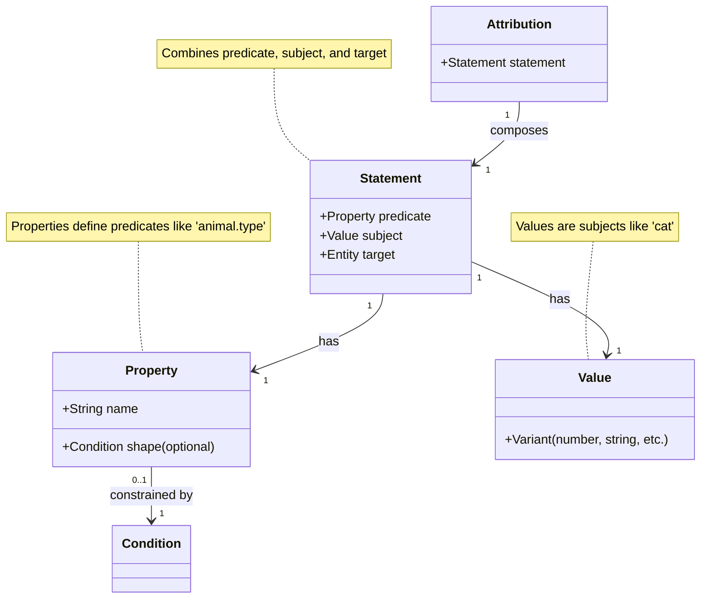

### Property Shapes and Constraints

Properties can have a **shape**—conditions limiting acceptable values. This ensures statements adhere to rules, enhancing reliability. Constraints vary by type:

| Type    | Constraint    | Description |
|---------|---------------|-------------|
| Number | equal        | Value must exactly match a specified number. |
| Number | greaterThan  | Value must be greater than a specified number. |
| Number | lowerThan    | Value must be less than a specified number. |
| String | equal        | Value must exactly match a specified string. |
| String | startsWith   | Value must start with a specified substring. |
| String | endsWith     | Value must end with a specified substring. |
| String | contains     | Value must contain a specified substring. |

These constraints prevent invalid statements, like assigning a non-numeric value to a numeric property.

## Accreditations

Accreditations delegate abilities within a Federation. There are two types:

- **Accreditation to Attest**: An accredited entity grants another the ability to make statements using a specific set of attributes.

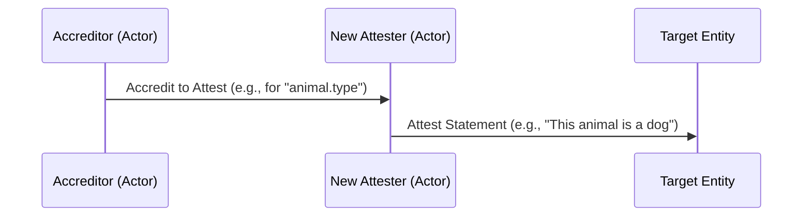

- **Accreditation to Accredit**: An accredited entity grants another the ability to further accredit others (to attest or accredit).

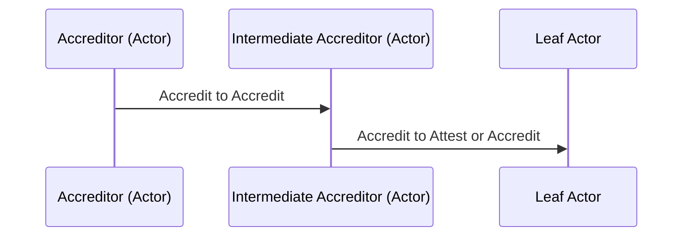

Here's a typical hierarchy in entity-relationship terms:

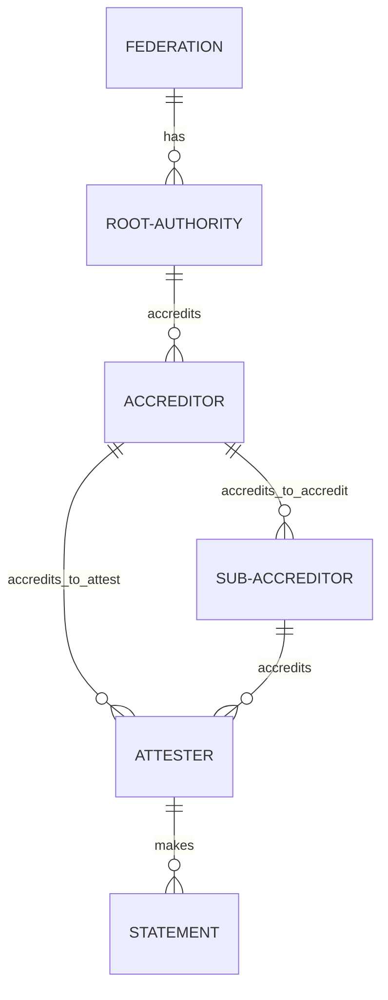

## IOTA Identity.rs vs. Hierarchies

At first glance, IOTA Identity (as described in the [IOTA Identity Framework](https://docs.iota.org/developer/iota-identity)) and Hierarchies might seem similar, both dealing with trust and verification. IOTA Identity focuses on Decentralized Identity (DID) and Verifiable Credentials (VCs), enabling individuals, organizations, and things to control and present verifiable data in a standardized way. It emphasizes privacy, security, and interoperability, allowing entities to prove attributes without revealing unnecessary information [[from IOTA Docs](https://docs.iota.org/developer/iota-identity)].

In contrast, IOTA Hierarchies emphasizes managing the distribution of unopinionated properties (which could become credentials) through delegations. It's specification-agnostic, focusing on hierarchical rights delegation rather than standardized presentation.

Can they work together? Absolutely—Hierarchies' flexibility allows seamless integration.

### IOTA Identity as Root Authority

Use an IOTA Identity as the Federation's Root Authority for instant credibility (e.g., linked to a Web2 domain via domain linkage credentials).

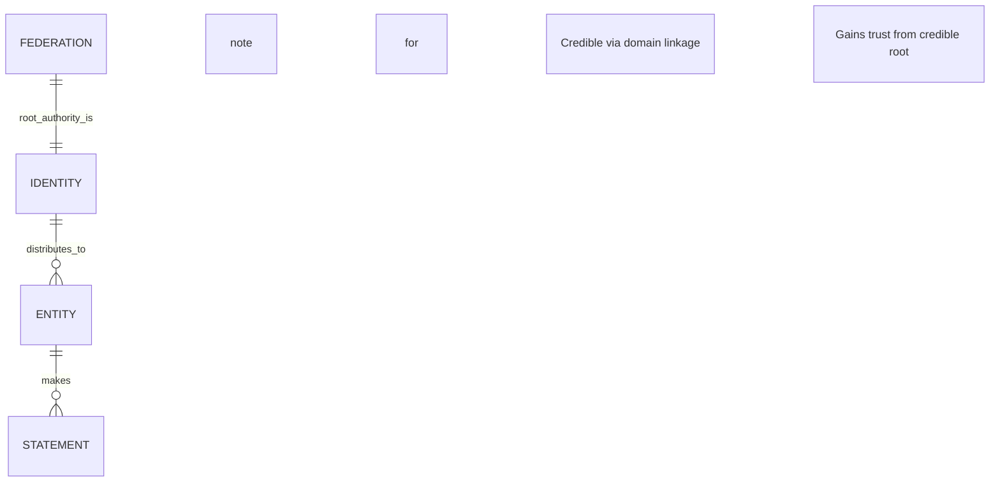

### IOTA Identity as Any Federation Member

Every entity in the hierarchy can be an IOTA Identity, boosting overall credibility.

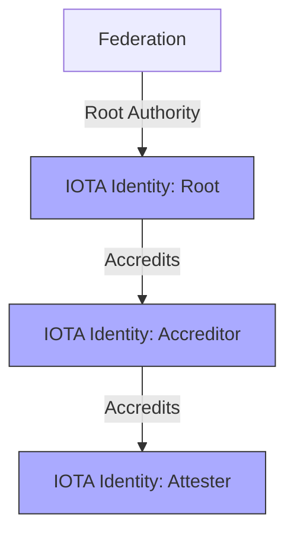

### IOTA Hierarchies as Credential Source for IOTA Identity

Hierarchies can validate issuers in IOTA Identity workflows. For example, a student's VC with a grade issued by a professor can be verified against a university Federation.

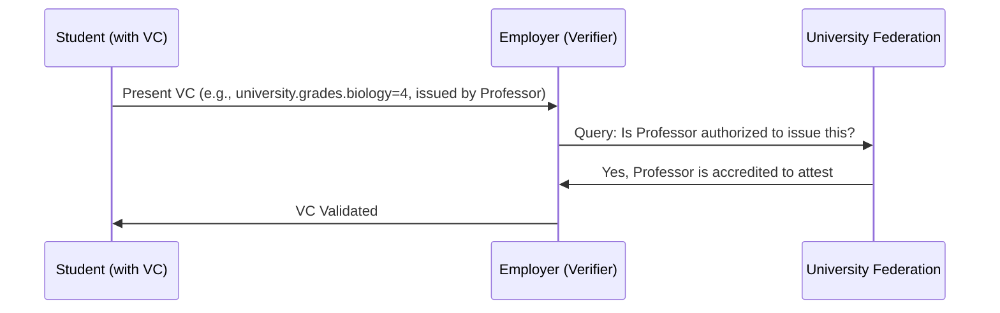

### Revocation of Accreditation

### Accreditation Process

The accreditation process allows an entity with appropriate permissions (an accreditor) to grant attestation or accreditation rights to another entity (the receiver) within the federation. This is done by specifying the statements the receiver is accredited for.

There are two types:

- Accreditation to accredit: Allows the receiver to further delegate accreditation rights.
- Accreditation to attest: Allows the receiver to create trusted attestations (statements).

The process involves calling functions like `create_accreditation_to_accredit` or `create_accreditation_to_attest` on the Federation object. The system verifies the accreditor's permissions (unless they are a root authority) and ensures the statements exist in the federation. If valid, the accreditation is added to the receiver's list, and an event is emitted.

#### Sequence Diagram for Accreditation Creation

```mermaid
sequenceDiagram
    participant Accreditor
    participant Federation
    participant Receiver
    Accreditor-&gt;&gt;Federation: create_accreditation_to_accredit(receiver, statements)
    Federation-&gt;&gt;Federation: Verify accreditor is root or has compliant accreditations
    Federation-&gt;&gt;Federation: Validate statements exist in federation
    alt Valid
        Federation-&gt;&gt;Federation: Add Accreditation to receiver's accreditations_to_accredit
        Federation-&gt;&gt;Federation: If new, transfer AccreditCap to receiver
        Federation-&gt;&gt;Federation: Emit AccreditationToAccreditCreatedEvent
    else Invalid
        Federation-&gt;&gt;Accreditor: Abort with error
    end
```

Note: A similar process applies for `create_accreditation_to_attest`.

### Revocation Process

Revocation removes the ability of an entity to perform new accreditations or attestations under a specific permission, but does not invalidate past actions.

It is performed by calling `revoke_accreditation_to_accredit` or `revoke_accreditation_to_attest`, specifying the entity ID and the permission ID (the UID of the Accreditation object).

The system verifies the revoker's permissions (unless root authority). If valid, it removes the specified Accreditation from the entity's list and emits a revocation event.

This revocation is immediate upon transaction execution. Any attestations or sub-accreditations created before the revocation remain valid, as they were issued when the accreditation was active.

#### Key Points on Revocation

- **Non-retroactive**: Past actions remain valid.
- **No Timestamp-based Revocation for Accreditations**: Unlike statements, where revocation sets a `valid_until` timestamp in the `Timespan` to expire at a future time, accreditations are revoked by direct removal. There is no built-in mechanism to set a future revocation time for accreditations.
- **Statement Revocation**: For trusted statements in the federation, `revoke_statement` or `revoke_statement_at` sets `valid_until_ms`, allowing past usages to remain valid while preventing new ones after the timestamp.
- **Timed Accreditations**: While not directly supported for revocation, accreditations could potentially be created with statements that have pre-set `valid_until` timestamps for automatic expiration.

This design ensures that revocation affects future capabilities without invalidating historical trust chains.
